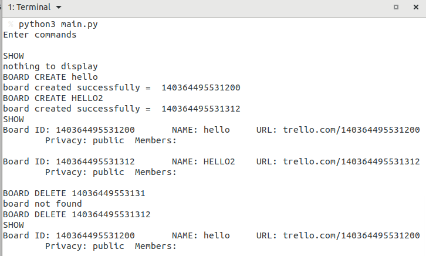
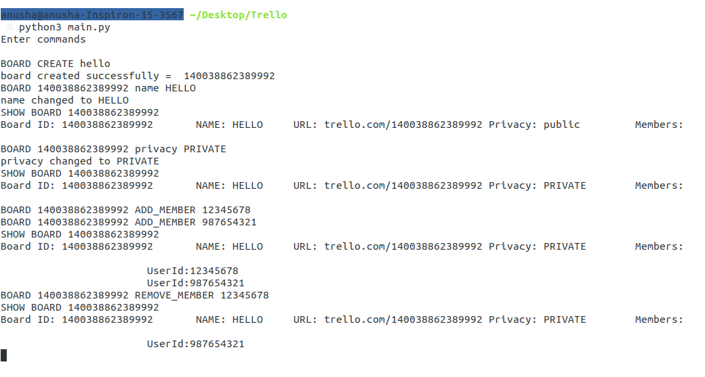
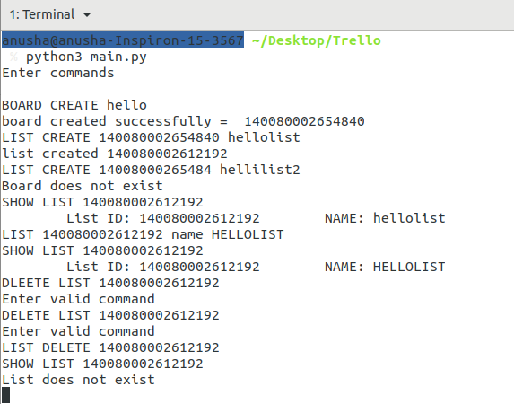
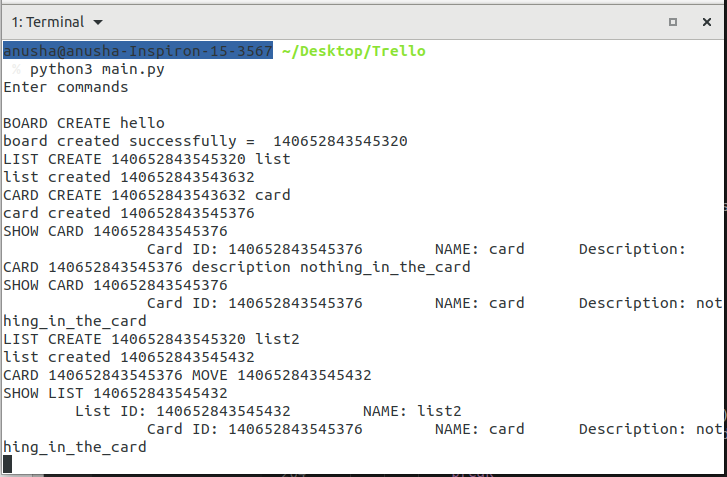
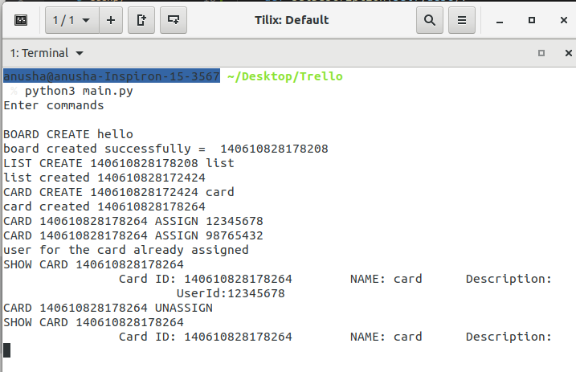

# 'Trello'
Python implementation of the Trello App

## class 'Board'

Functions:
- setPrivacy : set or change the 'privacy' of the board
- setName : set or change 'name' of the board
- createList : append new 'list' object to the board
- isList : check if given 'list' exists
- deleteList : delete the 'list' if exists
- addMember : add 'user' to the board
- removeMember : remove 'user' from the board
- displayBoard : display contents of the board

Attributes:
- id : randomly generated Id using 'Random' class
- name : name of the board
- url : ustogenerated url based on id
- privacy : privacy status of the board
- members : list of board members
- list : dictionary of lists id and its objects

Creating and Deleting Boards

- set name/privacy of the board
- add/remove members of board

## class 'Lists'

Functions:
- setName : set or change 'name' of the list
- setDescription : set or change 'description' of the list
- createCard : append new 'card' object to the list
- isCard : check if given 'card' exists
- deleteCard : delete the 'card' if exists
- displayList : display contents of the lsit

Attributes:
- id : randomly generated Id using 'Random' class
- name : name of the list
- description: description of the list
- cards : dictionary of cards id and its objects

- list create
- show list
- list delete

## class 'Card'

Functions:
- setName : set or change 'name' of the card
- isAssUser : check if user is assigned and return 'True' if yes.
- assUser : assign given user if no users assigned
- unAssUser : unassign if user exists
- displayCards : display contents of the card

Attributes:
- id : randomly generated Id using 'Random' class
- name : name of the card
- user : one 'User' object assigned if any

- card create
- show card
- set description
- move card (delete from old list, add to new list)

## class 'User'

Functions:
- displayUser : display contents of the user

Attributes:
- id : randomly generated Id using 'Random' class
- name : name of the list
- email('private') : email Id of the user

- assign user to card
- unassign user from card

## class 'Random'

Empty objets' id used as id of boards, lists, cards and users.
Function : None
Attributes : None

